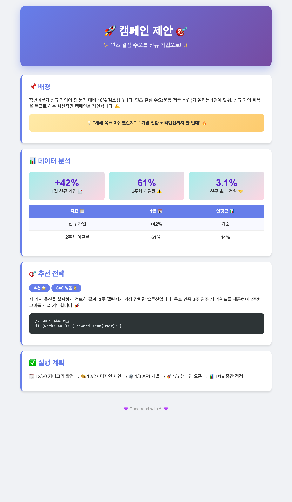
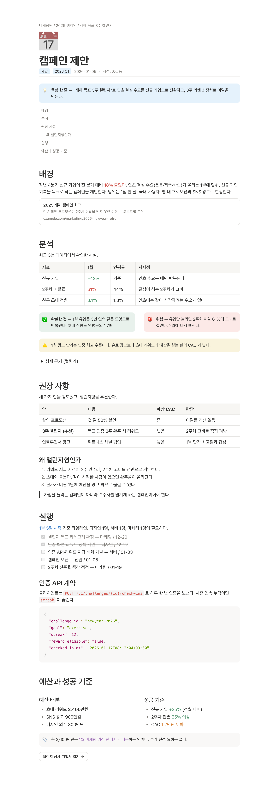
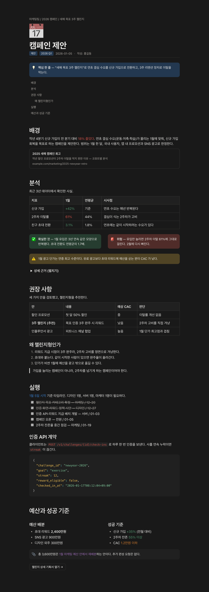

# 📄 notion-doc

> Make your AI agent write documents like Notion — not like an AI.

[English](README.md)

AI 에이전트에게 문서를 만들어 달라고 하면 매번 비슷한 게 나옵니다 — 보라 그라데이션
히어로, 이모지 범벅 헤더, 그림자 달린 카드. **notion-doc** 은 그 자리에 Notion의
디자인 언어를 입히는 에이전트 skill 입니다. 같은 요청, 같은 내용, 완전히 다른 결과:

| notion-doc 없이 | notion-doc 적용 |
|---|---|
|  |  |

문서의 내용·목차에는 관여하지 않습니다 — 구성은 내용(과 에이전트)이 정하고,
skill 은 모양만 규정합니다.

## 무엇을 하나

**Notion 블록 세트**

- 이모지 페이지 아이콘, 태그 pill, 메타 줄
- 콜아웃 4색 — 파랑(핵심)·회색(참고)·노랑(주의)·빨강(경고)
- simple table, 2단 컬럼 레이아웃
- `<details>` 토글, 체크리스트(완료 취소선), 인용구, 북마크 카드
- 코드 블록 신택스 하이라이트(Prism, 라이트/다크 토큰), 인라인 코드
- Notion 텍스트 색 5종 (파랑·빨강·주황·초록·보라)

**비주얼 정본 하나** — 에이전트가 CSS를 생성하지 않습니다.
[`template.html`](skills/notion-doc/template.html) 을 복사해서 내용만 채웁니다 —
본문 폭 708px, 글자색 `#37352F`, Notion 라이트/다크 팔레트 CSS 토큰 내장.
다크 모드는 뷰어 테마를 자동으로 따라갑니다:

| Light | Dark |
|---|---|
|  |  |

## 설치

**Claude Code (플러그인, 권장)**

```
/plugin marketplace add heyman333/agent-notion-template-docs
/plugin install notion-doc@agent-notion-template-docs
```

**Claude Code (수동 복사)**

```bash
# 프로젝트에만
cp -r skills/notion-doc <your-project>/.claude/skills/

# 모든 프로젝트에서
cp -r skills/notion-doc ~/.claude/skills/
```

**Codex, Cursor, Gemini CLI 등**

skill 은 Claude 전용 요소가 없는 평범한 파일 2개입니다 — 지시 파일을 읽는
에이전트라면 무엇이든 쓸 수 있습니다. 에이전트별 붙여넣기 스니펫(`AGENTS.md`,
`.cursor/rules`, `GEMINI.md`)은
[다른 에이전트에서 쓰기](docs/using-with-other-agents.md)를 보세요.

## 사용

설치 후에는 문서 생성 요청("~정리해서 문서로 만들어줘", "보고서 써줘",
"포스트모템 작성해줘")에 자동으로 적용됩니다. Claude Code 에서 명시적으로 부르려면:

```
/notion-doc:notion-doc
```

## 결과물 예시

브라우저로 열어 보세요. 위 스크린샷은 `sample.html` 입니다.

| 파일 | 내용 | 보여주는 블록 |
|---|---|---|
| [`sample.html`](examples/sample.html) | 캠페인 제안 | 콜아웃·표·토글·체크리스트 |
| [`sample-tech.html`](examples/sample-tech.html) | 장애 분석 | 코드 하이라이트, 빨간/노란 콜아웃 |
| [`sample-en.html`](examples/sample-en.html) | Campaign Proposal | 같은 디자인의 영어 문서 |
| [`before.html`](examples/before.html) | 비교용 "없이" 쪽 | 에이전트 기본 출력물 |

## 구조

```
.claude-plugin/
  plugin.json          # 플러그인 매니페스트
  marketplace.json     # 마켓플레이스 카탈로그
skills/notion-doc/
  SKILL.md             # 블록 사전(어떤 내용에 어떤 블록) + 비주얼 규칙
  template.html        # 스타일 정본: Notion 블록 CSS + 라이트/다크 팔레트 토큰
examples/              # 렌더링된 예시 문서
docs/
  using-with-other-agents.md
```

## 디자인 출처

비주얼의 기준은 Notion 페이지 그 자체입니다. 참고한 공개 페이지:
https://cautious-shovel-8bd.notion.site/3ccb975b320f80128e94c05534b4df9d

## License

[MIT](LICENSE)
