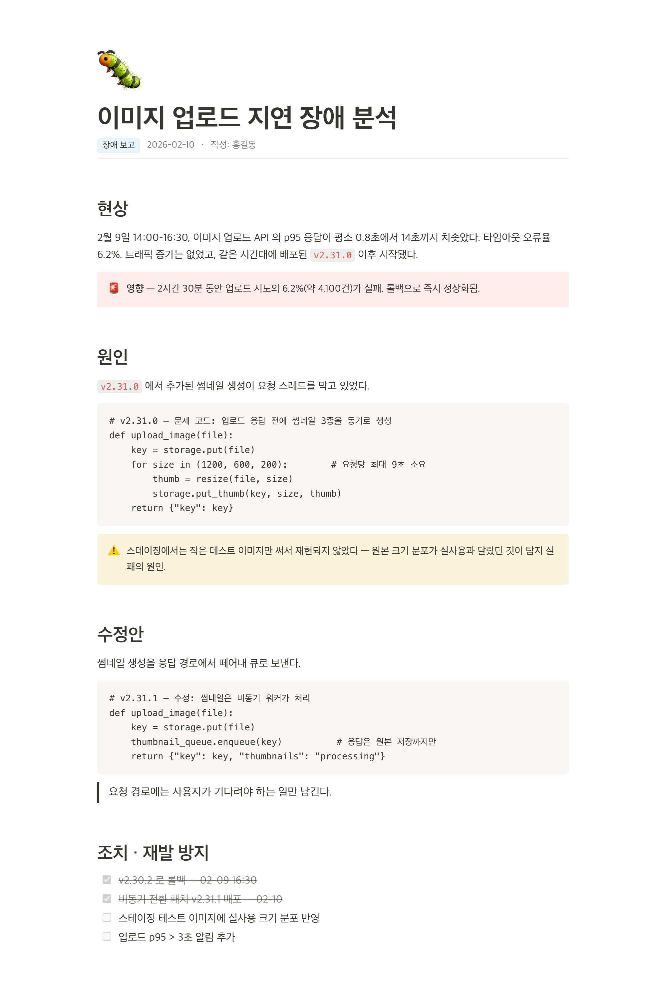

# 📄 notion-doc

> Make your AI agent write documents like Notion — not like an AI.

Claude Code로 문서를 만들어 달라고 하면 매번 다른 스타일의 결과물이 나옵니다.
**notion-doc** 은 문서의 내용·구성에는 관여하지 않고, **Notion의 블록과 디자인 언어**를
그대로 입혀서 어떤 세션에서 누가 요청해도 같은 비주얼의 문서가 나오게 하는
Claude Code skill 입니다.

| Light | Dark |
|---|---|
|  |  |

## 무엇을 하나

**구조는 자유, 디자인만 Notion.** 문서의 목차와 전개는 내용이 정합니다 — skill 은
특정 문서 포맷을 강제하지 않습니다. 대신 Notion 이 제공하는 기능·디자인 요소를
전부 쓸 수 있게 하고, 어떤 내용에 어떤 블록을 쓰는지 규칙만 줍니다.

**Notion 블록 세트**

- 이모지 페이지 아이콘 + 태그 pill 메타 줄
- 콜아웃 4색 — 파랑(핵심)·회색(참고)·노랑(주의)·빨강(경고)
- simple table, 2단 컬럼 레이아웃
- `<details>` 토글, 체크리스트(완료 취소선), 인용구, 북마크 카드
- 코드 블록 신택스 하이라이트(Prism, 라이트/다크 토큰), 인라인 코드
- Notion 텍스트 색 5종 (파랑·빨강·주황·초록·보라)

**비주얼 정본** — CSS를 매번 새로 생성하지 않습니다. skill에 포함된
[`template.html`](skills/notion-doc/template.html) 스켈레톤이 스타일 정본입니다.
본문 폭 708px, 글자색 `#37352F`, 라이트/다크 팔레트 CSS 토큰 내장 — 뷰어 테마를
자동으로 따라갑니다.

## 설치

**플러그인으로 (권장)**

```
/plugin marketplace add heyman333/agent-notion-template-docs
/plugin install notion-doc@agent-notion-template-docs
```

**수동 복사**

```bash
# 프로젝트에만
cp -r skills/notion-doc <your-project>/.claude/skills/

# 모든 프로젝트에서
cp -r skills/notion-doc ~/.claude/skills/
```

## 사용

설치 후에는 문서 생성 요청("~정리해서 문서로 만들어줘", "제안서 써줘", "버그 리포트
작성해줘")에 skill이 자동으로 적용됩니다. 명시적으로 부르려면:

```
/notion-doc:notion-doc
```

## 결과물 예시

브라우저로 열어 보세요. 위 스크린샷은 `sample.html` 입니다.

| 파일 | 내용 | 보여주는 블록 |
|---|---|---|
| [`sample.html`](examples/sample.html) | 캠페인 제안 | 콜아웃·표·토글·체크리스트 |
| [`sample-tech.html`](examples/sample-tech.html) | 장애 분석 | 코드 하이라이트, 빨간/노란 콜아웃 |
| [`sample-en.html`](examples/sample-en.html) | Campaign Proposal | 같은 디자인의 영어 문서 |

코드가 들어가는 기술 문서는 이렇게 나옵니다:



## 구조

```
.claude-plugin/
  plugin.json          # 플러그인 매니페스트
  marketplace.json     # 마켓플레이스 카탈로그
skills/notion-doc/
  SKILL.md             # 블록 사전(어떤 내용에 어떤 블록) + 비주얼 규칙
  template.html        # 스타일 정본: Notion 블록 CSS + 라이트/다크 팔레트 토큰
examples/
  sample.html          # 결과물 예시: 캠페인 제안
  sample-tech.html     # 결과물 예시: 장애 분석 (코드 하이라이트)
  sample-en.html       # 결과물 예시: 영어 문서
```

## 디자인 출처

비주얼의 기준은 Notion 페이지 그 자체입니다. 참고한 공개 페이지:
https://cautious-shovel-8bd.notion.site/3ccb975b320f80128e94c05534b4df9d

## License

[MIT](LICENSE)
